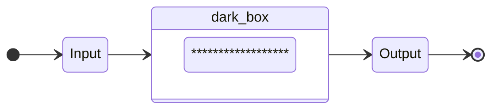
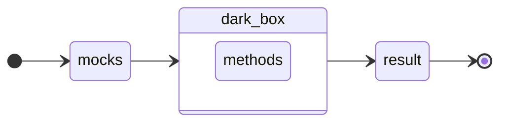
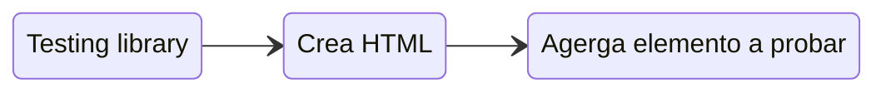

# Testing!

Las pruebas de nuestro código, hacen referencia a una **herramienta** encargada de analizar la funcionalidad y el rendimiento de un programa para mejorar la experiencia del usuario.

Una de estas formas de *probar* nuestro codigo es realizando testing de caja negra o mejor conocido como black box tests. 

## ¿Que es el unit test?

De su traducción literal, son pruebas unitarias. Pero, ¿que es lo que vamos a probar?
En los tests de caja negra, se prueba la logica de negocio.

Hay que hacer pruebas unitarias tanto en el front como en el back.

Beneficios de los unit tests: 

- Reducir la necesidad de codigo o pruebas manuales.
- Mejorar la calidad de codigo.
- Nos permite tener un correcto mantenimiento del codigo 
- El unit testing es una buenna inversion de tiempo.
- SE EJECUTA ANTES DE SUBIR A GIT || Bitbucket

## Prioritarios

- Mocks
- Caja negra
- Happy path
- Sad Path
- Arquitectura -> Testing

### Mocks

Un mock es tratar de cambiar como funciona una propiedad o una funcionalidad, a un ambiente controlado.

**Variable**
```js
const user = ??

const userMock = "castromaciellr'
```

**Método**
```js
const suma = (var1, var2) => var1 + var2

const sumaMock = () => 2
```

> "Siempre devuelve lo que esperamos"

Recomendacion: crear mock de los endpoints

```js
const login = async (email, password) => await postLogin(email, password)

const loginMock = async (email, password) => await Promise.resolve(true)
                                          => await Promise.reject(error)
```

### Caja negra

Simple diagrama de flujo



Caso real



> Para que nuestro test sea exitoso, el resultado tiene que ser igual a un resultado esperado.

#### Estructura recomendada para hacer unit testing.

```ts
const suma = (var1: number, var2: number):number => var1 + var2;
```

```ts
it('Should add two variables', () => {
  // Mocks or entries
  const var1Mock = 3
  const var2Mock = 7

  const expectedResult = 10
  // ----------------------

  const result = suma(var1Mock, var2Mock)

  expect(result).toEqual(expectedResult)
})
```

#### Pasos a tener en cuenta para escribir testing.

1. Identificar lógica de negocio. (Requerimentos del componente).
2. Identificar que resultado queremos que tenga o efectos de ejecutar nuestra lógica.
3. Crear los mocks de datos de entrada y de la logica externa.
4. Identificar casos extremos. (Si o si deben probarse)

### Happy path (Camino feliz) 😎

Siempre debe ocurrir. Es también lo que se llama acceptance critera / criterios de aceptación.

### Sad path (Camino triste) 🥲

Prioritario. Aqui va todo lo que no cumple con los criterios de aceptación como también los casos extremos.

### Recomendaciones:

Que hago cuando ya tengo un proyecto finalizado, pero no tenemos testing??

1. Aplicar testing siempre en todo lo nuevo. (Sin excepción).
2. Tenemos codigo muy acoplado = No se puede dividir sin hacer refactor.
    * Identificar funcionalidades prioritarias
    * _**Tratar**_ de hacer mocks metodos excluyentes
    * Definir nuevamente los _**Happy path**_ 
    * Definir nuevamente los _**Sad path**_ -> Si o si los casos extremos.

### Test coverage (Covertura de codigo) 🧪

Hay muchas formas de verlos. Se usan distintas variantes/conceptos.
Son los diferentes caminos que se estan testeando.

Covertura que va a estar definida por **Lineas de código**

Por ejemplo un Login con 20 lineas de codigo, y nosotros tenemos testeadas 18 lineas de codigo, entonces el coverage es de un 90%.

El porcentaje que se tiene que alcanzar es aproximadamente un 80% Para codigos prioritarios !!! 

Ejemplo:

```ts
const isHigher = (num1: number, num2: number) => {
  if (num1 > num2) {
    console.log('es mayor')
  } else {
    console.log('es menor')
  }
}
```


// **Sad Path**
```ts
(2, 3) => {
  if (2 > 3) ✅
  ...
  else { ✅
    console.log('es menor') ✅
  }
}
```

Supongamos que este test nos da un 60% del coverage

// **Happy Path**
```ts
(3, 2) => {
  if (3 > 2) ✅
    console.log('es mayor')
  ...
}
```
Supongamos que este test nos da un 40% del coverage

Sumando ambas pruebas, hacemos un 100% del coverage.

## Testing library

React testing library introduce una nueva API cuyos principales métodos son _**render**_ y _**screen**_. Con render podemos montar un componente de la forma habitual en React y con el singleton screen podemos leer lo que hay en él. Está centrado en el usuario

Javascript -> Testing Framework

Typescript -> Testing Library

Podemos introducir testing a cualquiera de estos frameworks.
Cambia el paradigma de hacer unit testing, esto es por que ahora los tests estan centrados en la interaccion que tiene el usuario para/con nuestros components.

Caracteristicas: 

- Ignora detalles de implementación
- Consulta el _**DOM**_

## Glosario del testing:

### describe

Consulta todos los test que describen el comportamiento que debe tener nuestro elemento a probar.

### Mock

Un mock es tratar de controlar lo que son variables y metodos con lo que nosotros esperamos. Por ejemplo si nosotros llamamos al login, esperamos una respuesta con informacion del usuario que esta iniciando.
Esta informacion es dinamica. por ello es que podemos generar un mock, que lo que hace es controlar este resultado.

```tsx
const mockedUser = {
  name: 'castromaciel',
  email: 'castromaciel@gmail.com'
}
```

### afterEach

Logica que se ejecuta luego de cada test, especial para volver a inicializar los mocks de prueba a sus valores iniciales.

```tsx
afterEach(jest.clearAllMocks)
```

### beforeEach

Se ejecuta antes de cada test. Recomendado para preparar funcionalidades que se reutilizan entre cada test.

```tsx
beforeEach(() => {
  render(<Login />)
})
```

## Estructura con jest

```tsx
// describe el comportamiento del elemento
describe('Componente', () => {
  // a quien describimos

  beforeEach(() => {
    // antes de cada test
  })

  afterEach(() => {
    // despues de cada test
  })

  // describe que debe hacer
  it('Hacer algo', () => {
    // logica del test
  })
})
```

```tsx
describe('Login', () => {
  let renderInstance;
  const mockedUser = {
    name: 'castromaciel',
    email: 'castromaciel@gmail.com'
  };

  beforeEach(() => {
    renderInstance = render(<Login />);
  })

  afterEach(jest.clearAllMocks)

  it('should render login', () => {
    expect(renderInstance).toBeTruthy();
  })
})
```

## Mindset Testing library



### Importante !!

Para que el testing se realice correctamente

- Atomicidad
- Cada componente debe ocuparse de una única lógica
- Componentes reutilizables
- Componentes que no requieran de otros

> Esto nos facilitará el testing

### Snapshot del DOM


#### Como accedemos al snapshot? 

Importar el metodo **screen** de la librería.

Screen es el metodo para poder interactuar y consultar con el DOM, es el DOM simulado que nos brinda testing library.

## Tipos de queries

Hay fundamentalmente 3 tipos de query

  - **getBy**: Obtiene el elemento que cumpla con la condicion de la query y devuelve un error en dos casos
    - Si no encuentra ningun elemento
    - Si encuentra mas de uno

  - **queryBy**: Es similiral al getBy con la diferencia de que no da un error si no encuentra el elemento. Es generalmente utilizado para opcionales.

  - **findBy**: Espera un determinado tiempo a que se cumpla la condición por medio de una promesa, si no se cumple esta se rechaza.

> Para buscar más de un elemento, agregar la palabra "_**all**_" al tipo de query.

Ej: **getAllby**

### Principales queries.

  - **ByRole**: especial para encontrar elementos por el rol que cumplen. Los roles asigandos por el browser (button, tab).

    ```ts
    screen.getByRole('button', { name: 'Mi texto' })
    ```

  - **ByLabelText**: elemento que contenga el label que indicamos:
    ```ts
    screen.getByLabelText('Mi label')
    ```

  - **ByText**: elemento con el texto indicado
    ```ts
    screen.getByText('Mi texto')
    ```

  - **ByTestId**: podemos introducir el atributo _data-testid_ para identificar los elementos (este se elimina sol al pasar a producción)
    ```tsx
    <div data-testid='mi-elemento'>Elemento</div>

    screen.getByTestId('mi-elemento')
    ```

## Sincrono

Consultar en el snapshot si el elemento existe en este instante.

```ts
expect(screen.getByText('Existo, luego pienso')).toBeInTheDocument()
```

Esto es sencillo siempre y cuando no tengamos renders que dependan de ciertas condiciones.

## Asincrono

Vamos a esperar a que suceda cierta interaccion del usuario para que aparezca el elemento en pantalla.

1. Importar método **waitFor**, este espera por todo lo que pongamos en su interior.

    waitFor
    ```ts
    await waitFor(() =>{
      expect(screen.getByText('Pienso, luego existo')).toBeInTheDocument()
    })
    ```
    ```ts
    it("muestra en pantalla 'mi texto'", async() => {


      await waitFor(() =>{
        expect(
          screen.getByText('mi texto')).toBeInTheDocument()
      })
    })
    ```
    > Si no aparee luego de un tiempo, se considera un **test fallido**

2. Uso de **findBy**, esperará por la condición y si no lo hace, dará un error.
    ```ts
    await screen.findByText('mi texto')
    ```
    ```ts
    expect(await screen.findByText('Pienso, luego existo')).toBeInTheDocument()
    ```

## Ejemplos de uso

```tsx
<h3>Esto es un test</h3>

screen.getByText('Esto es un test')
```

```tsx
<input type="text" data-testid="input-test" />

screen.getByTestId('input-test')
```

```tsx
(... texto luego de una carga ...)
<p>tu valor es: { value }</p>

await waitFor(() => {
  expect(screen.getByText("tu valor es: valueFromApi")).toBeInTheDocument()
})
```
